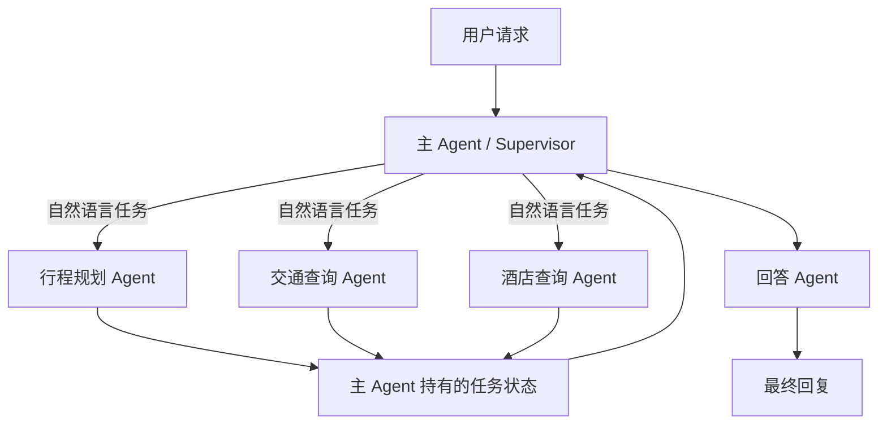

# 多 Agent 旅游链路重塑计划书

## 一、背景与目标

当前系统将普通对话和完整旅游规划分成 `general_agent` 与 `trip_planner` 两条链路。随着景点研究、
天气、交通、酒店和多轮追问能力增加，继续在固定路由和固定流程上增加分支会让职责越来越混乱。

本次重塑采用“一主多从”的多 Agent 架构：

- 主 Agent 负责理解意图、拆分任务和协调运行。
- 行程、交通、酒店由独立的专业 Agent Runtime 执行。
- 回答 Agent 汇总结构化结果并生成最终回复。

目标是让系统能够根据用户自然语言动态组合能力，同时保持 Agent 职责清晰、上下文隔离、运行过程
可见、结果可追踪。

## 二、目标架构



主 Agent 是唯一协调中心。三个业务子 Agent 完全隔离，不能直接通信，也不能读取其他 Agent 的任务、
上下文、工具调用和结果。

## 三、Agent 职责

### 1. 主 Agent

主 Agent 负责：

- 读取当前用户输入和必要的会话上下文。
- 判断是闲聊、单项查询还是组合旅行请求。
- 将用户请求拆成一个或多个自然语言任务。
- 并行启动对应的专业 Agent。
- 接收子 Agent 的成功结果、失败信息和缺失字段。
- 汇总缺失信息并统一向用户追问。
- 在业务任务完成后启动回答 Agent。

普通问候、闲聊和不需要专业工具的简单请求，由主 Agent 直接回复。

主 Agent 不直接调用 FlyAI 或高德业务工具，也不代替专业 Agent 检查具体工具参数。

### 2. 行程规划 Agent

职责：

- 生成多日旅游攻略。
- 查询具体景点信息。
- 查询景点门票、讲解、演出和相关旅游商品。
- 查询并合并出行日期对应的天气。

工具：

- FlyAI `ai_search`
- FlyAI `search_poi`
- FlyAI `keyword_search`
- 高德天气查询

使用原则：

- 生成旅游攻略时调用 `ai_search`。
- 查询具体景点时调用 `search_poi`。
- 查询门票时先确认景点，再调用 `keyword_search`。
- 日期已知时，`ai_search` 和天气查询并行执行。
- 日期缺失时，`ai_search` 仍可生成并保存行程草案，天气子任务单独反馈缺失日期。
- 用户补充日期后只恢复天气查询和结果合并，不重复执行已经完成的 `ai_search`。

`ai_search`、景点详情、门票和天气是解耦能力，由行程规划 Agent 根据用户意图按需组合。

### 3. 交通查询 Agent

职责：

- 查询航班。
- 查询火车和高铁。
- 根据用户意图执行单项查询或交通方式比较。
- 自行判断出发地、目的地和日期等条件是否完整。

工具：

- FlyAI `search_flight`
- FlyAI `search_train`

### 4. 酒店查询 Agent

职责：

- 查询目的地酒店。
- 理解入住、退房、预算、星级、床型和位置偏好。
- 自行判断酒店查询条件是否完整。

工具：

- FlyAI `search_hotel`

交通和酒店结果作为独立信息展示给用户，不要求反向修改行程规划 Agent 生成的每日安排，具体选项由
用户自行决定。

### 5. 回答 Agent

回答 Agent 只负责：

- 接收主 Agent 提供的结构化业务结果。
- 组织行程、天气、交通和酒店信息。
- 统一格式、语言和展示层次。
- 如实呈现空结果、部分成功、缺失数据和工具失败。

回答 Agent 不调用外部工具，不修改专业 Agent 的业务结果，也不补造价格、班次、酒店、天气或景点事实。

## 四、任务拆解与通信方式

主 Agent 与子 Agent 之间使用自然语言表达任务。

例如：

```text
用户：规划一份去西安的三日旅游攻略，顺便查一下去西安的高铁和西安的酒店。

行程规划任务：规划一份去西安的三日旅游攻略。
交通查询任务：查一下去西安的高铁。
酒店查询任务：查一下西安的酒店。
```

如果此前对话已经确认出发地、日期等信息，主 Agent 应将这些信息自然地带入对应任务，但具体字段是否
满足工具要求，仍由子 Agent 自己判断。

自然语言负责表达任务语义；任务身份、运行状态、缺失字段和结果采用结构化形式返回，便于并行、恢复、
展示和审计。

## 五、上下文与状态隔离

### 上下文边界

- 主 Agent 可以读取与当前请求有关的会话历史。
- 子 Agent 只接收自己的自然语言任务和完成任务所需的相关上下文。
- 子 Agent 不接收兄弟 Agent 的任务、结果或运行过程。
- 每个 Agent Runtime 的模型消息、工具调用和临时上下文相互隔离。
- 回答 Agent 只接收用户当前请求、必要背景和结构化业务结果。

### 主 Agent 任务状态

系统维护一份由主 Agent 独占的任务状态，用于记录：

- 本轮拆出了哪些任务。
- 每个 Agent 当前是运行、等待输入、成功、部分成功、失败还是取消。
- 哪些结果已经完成并保存。
- 哪些字段需要用户补充。
- 用户补充信息后需要恢复哪些任务。

这不是所有 Agent 共享读写的公共白板。子 Agent 只能接收自己的任务，并向主 Agent 返回自己的状态和结果。

当部分 Agent 成功、部分 Agent 缺少字段时：

1. 已成功的结果保留但暂不生成最终回答。
2. 其他可执行 Agent 继续运行。
3. 缺字段 Agent 返回 `needs_input`。
4. 主 Agent 汇总缺失字段并向用户追问。
5. 用户补充后只恢复相关任务。
6. 当前请求所需结果完成后再启动回答 Agent。

行程规划 Agent 内部也允许部分完成，例如 `ai_search` 已完成而天气仍在等待出行日期。

## 六、前端状态与可观测性

前端需要实时展示 Agent Runtime 状态，例如：

```text
主 Agent：正在理解并拆分请求
行程规划 Agent：正在生成攻略
交通查询 Agent：正在查询高铁
酒店查询 Agent：缺少入住和退房日期
回答 Agent：等待业务结果
```

行程规划 Agent 的解耦任务也可以独立展示：

```text
行程规划 Agent：部分完成
  - ai_search：已完成
  - 天气查询：等待补充出行日期
```

普通用户默认看到简洁状态；需要排查时，可以展开查看脱敏后的 Agent Trace 和工具调用记录。

系统需要保存：

- 主 Agent 的任务拆解结果。
- 每个 Agent 的启动、运行、等待输入、完成和失败状态。
- Agent 调用的工具、脱敏参数、耗时、结果状态和错误码。
- 子 Agent 返回的缺失字段。
- 回答 Agent 使用的业务结果来源。

一次用户请求、一次 Agent Runtime 和一次工具调用必须能够相互关联。

Trace 不保存 Agent 的内部思维过程、完整系统提示词、鉴权信息、未脱敏供应商响应和无关的完整对话。

对于 FlyAI，需要分别识别进程退出状态、供应商返回状态、数据解析状态和业务可用状态，避免把已经成功
返回的数据简单归类为 CLI 失败。

前端状态、主 Agent 判断和持久化 Trace 应来自同一套运行事件，确保三者一致。

## 七、典型运行链路

### 闲聊

```text
用户 → 主 Agent 直接回复
```

### 单项业务请求

```text
用户 → 主 Agent → 对应专业 Agent → 回答 Agent → 用户
```

### 组合旅行请求

```text
用户
→ 主 Agent 拆分任务
→ 行程、交通、酒店 Agent 并行执行
→ 主 Agent 汇总结构化结果
→ 回答 Agent 统一润色
→ 用户
```

### 缺少字段

```text
多个 Agent 并行执行
→ 可执行任务继续并保存结果
→ 缺字段任务返回 needs_input
→ 主 Agent 统一追问
→ 用户补充信息
→ 只恢复相关任务
→ 回答 Agent 生成最终回复
```

## 八、迁移原则

链路重塑采用逐步替换方式：

1. 建立统一 Agent Runtime、主从通信和任务状态能力。
2. 分别接入行程、交通和酒店专业 Agent。
3. 接入回答 Agent、前端运行状态和 Trace。
4. 通过开关让部分请求进入新链路并验证稳定性。
5. 新链路达到验收要求后，再移除旧的 `general_agent` 和 `trip_planner` 入口。

现有 FlyAI、高德、SSE、会话和工具审计能力应优先复用。本次重塑的重点是 Agent 分工、任务编排、
上下文隔离和运行可观测性，而不是重新实现供应商接入。

## 九、验收标准

- 主 Agent 能直接处理闲聊。
- 主 Agent 能正确拆分单项和组合请求。
- 三个业务 Agent 在独立 Runtime 中运行且不能互相通信。
- 每个子 Agent 只能调用本领域工具。
- 缺失字段由子 Agent 判断，再由主 Agent 统一追问。
- 一个 Agent 等待输入时不阻塞其他 Agent。
- 已完成任务不会因补充其他字段而重复执行。
- `ai_search` 与天气保持解耦，日期已知时能够并行。
- 日期缺失时能够保留行程草案，只恢复天气任务。
- 回答 Agent 只润色结构化结果，不补造事实。
- 前端能够实时展示 Agent 和内部工具任务状态。
- Agent Trace 与工具调用日志能够完整关联并用于问题排查。

