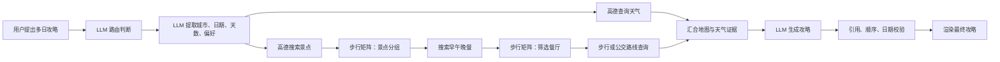

# 多日旅游攻略轻量规划工作流实施计划

## 1. 背景

当前系统已经具备用户意图识别、字段提取、高德工具调用、SSE 输出和单 Agent 工具调用闭环。

原有多日攻略链路为：



这条链路存在以下问题：

1. 在景点分组前计算完整步行矩阵，请求量较大。
2. 餐厅召回和餐厅矩阵明显增加链路复杂度，但不是当前版本的核心能力。
3. 仅使用步行矩阵不适合跨片区景点。
4. 如果使用驾车矩阵排序、最后却推荐公交，优化目标与实际交通方式不一致。
5. 当前每天只有约3～5个景点，没有必要引入OR-Tools、多车辆VRP等复杂模型。
6. LLM如果直接参与景点选择和路线排序，结果稳定性、可测试性和可解释性较差。

因此，本次重构目标是形成一条：

> LLM负责理解和表达，普通代码负责筛选与编排，高德负责事实数据。

的轻量确定性工作流。

---

## 2. 本期目标

用户输入固定为：

```text
目标城市 + 游玩天数 + 偏好（可选）+ 出行日期
```

例如：

```text
8月10日去南京玩3天，喜欢历史文化和博物馆。
```

系统需要完成：

1. 提取城市、日期、天数和偏好。
2. 从高德召回候选景点。
3. 对候选景点去重、过滤和评分。
4. 根据空间位置和每日容量进行分天。
5. 对每天的景点顺序进行轻量优化。
6. 查询最终相邻景点的真实交通路线。
7. 查询出行日期范围内可获得的天气信息。
8. 生成结构化行程。
9. 由LLM将结构化行程转换成自然语言攻略。
10. 对LLM输出进行一致性校验。

---

## 3. 本期不做

本期明确不实现：

```text
酒店推荐与酒店作为每日起终点
餐厅推荐及餐厅时间矩阵
航班、火车、酒店联动
景点门票和预约状态
景点精确营业时间约束
实时位置导航
多城市联合规划
多Agent协作规划
完整公交或驾车时间矩阵
OR-Tools路径优化
遗传算法、蚁群算法等复杂启发式算法
```

餐饮部分只在攻略中预留午餐、晚餐时间，不搜索具体餐厅。

---

## 4. 最终工作流

```mermaid
flowchart LR
    A["用户输入多日攻略需求"] --> B["LLM 路由判断"]
    B --> C["LLM 提取结构化字段"]

    C --> D["生成固定POI检索任务"]
    C --> E["高德天气查询"]

    D --> F["高德POI并发召回"]
    F --> G["POI标准化与精确去重"]
    G --> H["无效POI过滤"]
    H --> I["候选景点评分与多样性选择"]

    I --> J["容量约束地理分天"]
    J --> K["每天使用直线距离优化顺序"]
    K --> L["查询最终相邻景点真实路线"]
    L --> M["真实路线异常时执行一次局部调整"]

    E --> N["天气与每日路线组匹配"]
    M --> N

    N --> O["生成结构化行程结果"]
    O --> P["LLM生成旅游攻略"]
    P --> Q["景点、顺序、日期和交通校验"]
    Q --> R["SSE渲染最终攻略"]
```



高德POI搜索2.0支持关键字、类型和区域等地点搜索方式；路径规划接口支持步行、公交和驾车路线查询；天气接口根据城市行政区编码查询实况或预报信息。上述能力足以支撑本期工作流。

---

## 5. LLM职责

本工作流只在两个环节调用LLM。

### 5.1 输入结构化提取

输入：

```text
8月10日去南京玩3天，喜欢历史文化和博物馆。
```

输出固定Schema：

```json
{
  "intent": "multi_day_trip",
  "city": "南京",
  "start_date": "2026-08-10",
  "days": 3,
  "preferences": [
    "历史文化",
    "博物馆展览"
  ]
}
```

字段要求：

```text
city：必须存在
start_date：必须为标准日期
days：正整数，第一版建议限制为1～7天
preferences：允许为空，只能输出系统支持的标准标签
```

### 5.2 最终攻略生成

LLM接收已经确定的结构化行程，只负责：

```text
为每天生成游览主题
解释景点组合理由
把路线信息转换为自然语言
补充已确认的天气建议
组织行程节奏和阅读结构
```

LLM不得：

```text
新增结构化结果中不存在的景点
删除或替换已选景点
修改景点访问顺序
编造交通时间、票价或天气
编造景点营业时间
擅自推荐具体餐厅
```

---

## 6. 偏好标签设计

为了避免LLM自由生成不可控关键词，系统维护有限的偏好标签：

```text
历史文化
博物馆展览
自然风光
城市地标
特色街区
摄影打卡
亲子游
休闲慢游
夜景体验
```

每个标签对应固定POI检索关键词和POI类型映射。

示例：

```yaml
历史文化:
  keywords:
    - 历史古迹
    - 文化遗址
    - 名人故居
    - 古建筑

博物馆展览:
  keywords:
    - 博物馆
    - 纪念馆
    - 美术馆
    - 展览馆

自然风光:
  keywords:
    - 风景区
    - 公园
    - 湿地
    - 湖泊

特色街区:
  keywords:
    - 历史街区
    - 步行街
    - 文化街区
```

LLM只负责把用户自然语言映射到这些标准标签，不负责自由设计检索策略。

---

## 7. 高德POI召回

### 7.1 无偏好基础召回

无论用户是否填写偏好，都执行基础查询：

```text
城市 + 风景名胜
城市 + 历史古迹
城市 + 博物馆
城市 + 公园
城市 + 城市地标
城市 + 特色街区
```

### 7.2 偏好追加召回

根据标准偏好追加对应关键词。

例如用户偏好为：

```text
历史文化、博物馆展览
```

追加：

```text
城市 + 文化遗址
城市 + 古建筑
城市 + 名人故居
城市 + 纪念馆
城市 + 美术馆
```

### 7.3 请求方式

所有POI查询并发执行，但需要配置最大并发数：

```text
AMAP_POI_MAX_CONCURRENCY = 5
```

每个查询只取前若干条结果：

```text
AMAP_POI_PAGE_SIZE = 10
```

合并后的原始候选池建议限制为：

```text
MAX_RAW_POI_CANDIDATES = 60
```

必须设置目标城市或行政区域限制，防止出现其他城市的同名POI。高德POI搜索支持关键字、类型以及区域限定，并会按照其搜索能力返回综合排序结果。

---

## 8. POI标准化与去重

去重分为四层。

### 8.1 POI ID精确去重

相同高德POI ID只保留一条记录。

同时累计：

```text
命中了多少个检索关键词
每次检索中的排名
命中了哪些偏好标签
```

这些信息用于后续评分。

### 8.2 辅助设施过滤

删除不能独立作为景点的POI：

```text
停车场
售票处
景区出入口
游客中心
卫生间
便利店
礼品店
服务区
公交站
地铁站
```

过滤优先使用POI类型码，名称关键词仅作为兜底。

### 8.3 名称标准化

对名称执行：

```text
删除目标城市前缀
删除多余空格和标点
统一全角半角
删除通用后缀
```

通用后缀包括：

```text
景区
风景区
旅游区
风景名胜区
旅游景区
```

但不能仅因为后缀相同就合并POI。

### 8.4 名称和坐标模糊去重

当两个POI满足：

```text
标准化名称高度相似
AND 经纬度距离小于配置阈值
AND POI类型相同或接近
```

则判定为疑似重复。

建议默认阈值：

```text
普通POI：200米
大型景区：不进行自动空间合并
```

大型景区内部可能包含多个独立景点，因此只进行标记，不自动删除。

---

## 9. 候选景点评分

本期不依赖高德评分字段，也不让LLM逐个判断景点价值。

使用确定性规则评分：

```text
candidate_score =
    recall_score
  + preference_score
  + representation_score
  + spatial_score
  - duplicate_penalty
  - isolation_penalty
```

### 9.1 召回分

考虑：

```text
被多少个关键词命中
在每个查询结果中的排名
是否被基础查询和偏好查询同时命中
```

示例计算：

```text
某景点被4个关键词命中
并且多次出现在前5名
→ 召回分较高
```

### 9.2 偏好匹配分

景点POI类型与用户偏好标签匹配时加分。

无偏好时，此项使用统一默认值，不影响代表性景点排序。

### 9.3 城市代表性分

一个景点在多个基础查询中稳定靠前时，提高代表性分。

本期不维护手工“城市必去景点库”，避免引入额外数据维护。

### 9.4 空间适配分

与其他高分候选距离适中的景点加分。

与所有候选都明显隔离、且自身基础分不高的景点减分。

### 9.5 多样性惩罚

使用MMR式贪心选择思想：

```text
每次选择：
原始价值较高
且与已选景点类型不过度重复
且与已选景点空间关系合理
的景点
```

避免出现：

```text
一天或整个行程全部是博物馆
连续选择多个高度相似的小型公园
选择多个属于同一景区的重复POI
```

### 9.6 最终景点数量

默认每天安排3～4个景点：

```text
target_count = days × 4
```

边界：

```text
最少：days × 3
最多：days × 5
全局上限：25
```

最终数量还需要根据景点预计游览时长调整。

---

## 10. 景点游览时长估算

本期暂不引入外部内容平台数据，使用POI类型配置估算：

```yaml
large_scenic_area: 180
large_museum: 150
museum: 120
park: 120
historical_site: 90
temple: 75
former_residence: 60
city_landmark: 60
viewpoint: 45
historic_district: 120
commercial_pedestrian_area: 90
```

单位为分钟。

配置项只用于算法预算，不对用户宣称为景点官方建议时长。

每天默认时间预算：

```text
09:00—18:30：570分钟
午餐、休息、缓冲：90分钟
可用于景点和交通：480分钟
```

关键配置：

```text
DAY_TOTAL_BUDGET_MINUTES = 570
DAY_RESERVED_MINUTES = 90
DAY_EFFECTIVE_BUDGET_MINUTES = 480
```

---

## 11. 景点分天算法

本期不使用完整时间矩阵，也不使用K-Means的固定中心假设。

采用轻量的“分散种子 + 容量约束分配”。

### 11.1 计算基础距离

使用景点经纬度计算球面直线距离。

这一阶段的目的只是判断景点空间邻近关系，不作为最终交通时间展示。

### 11.2 选择每日种子

假设用户游玩D天：

1. 选择综合评分最高的景点作为第一个种子。
2. 后续每次选择与已有种子总体距离较远、且评分较高的景点。
3. 共选择D个种子。

这样可以避免所有种子集中在同一区域。

### 11.3 分配剩余景点

依次处理剩余候选：

```text
优先分配到距离最近的种子所在日
同时校验该日景点数量
同时校验该日预计总时长
同时考虑类型多样性
```

如果最近的一天已满，则尝试次近的一天。

### 11.4 单日容量约束

每天满足：

```text
景点数量建议为3～5个
预计游览时长 + 粗略交通缓冲 ≤ 480分钟
```

粗略交通缓冲可以使用直线距离映射：

```text
0～1公里：15分钟
1～3公里：25分钟
3～8公里：40分钟
8公里以上：60分钟
```

这只是分组阶段的预算近似，不直接展示给用户。

### 11.5 分组后局部调整

执行有限次局部交换：

```text
将景点A从Day 1移动到Day 2
或交换Day 1的景点A与Day 2的景点B
```

只有当以下综合成本下降时才接受：

```text
组内总距离
每日时长不平衡程度
类型重复程度
容量超限惩罚
```

最大迭代次数做成配置，默认不超过20次。

---

## 12. 每日顺序优化

每一天通常只有3～5个景点。

不引入OR-Tools，直接枚举所有访问顺序：

```text
3个景点：6种顺序
4个景点：24种顺序
5个景点：120种顺序
```

本地计算量可以忽略。

初始路线成本：

```text
route_cost =
    相邻景点直线距离成本
  + 时间段不匹配惩罚
  + 路线折返惩罚
```

时间段规则示例：

```text
大型景区、大型博物馆
→ 优先安排上午或中午前

特色街区、夜景、步行街
→ 优先安排下午或傍晚

游览时间较长的景点
→ 不安排在最后一站
```

本期没有酒店，因此每天生成开放路线：

```text
景点A → 景点B → 景点C → 景点D
```

不计算第一站之前和最后一站之后的路线。

---

## 13. 最终相邻路线查询

完成初始分天和排序后，只查询最终相邻景点。

例如：

```text
南京博物院
→ 总统府
→ 夫子庙
→ 老门东
```

只需要查询：

```text
南京博物院 → 总统府
总统府 → 夫子庙
夫子庙 → 老门东
```

不查询所有景点两两之间的完整矩阵。

高德路径规划接口支持步行、公交和驾车方式，可以根据本地规则选择具体调用方式。

### 13.1 第一轮交通方式选择

根据直线距离决定首先查询的接口：

```text
直线距离 ≤ 1.5公里
→ 查询步行路线

直线距离 > 1.5公里
→ 查询公交路线
```

### 13.2 公交降级规则

出现以下情况时，补查驾车路线并作为打车方案：

```text
公交无结果
公交换乘次数超过配置上限
公交耗时明显异常
公交总步行距离过长
接口调用失败
```

默认配置：

```text
MAX_WALK_DISTANCE_METERS = 1800
MAX_TRANSIT_TRANSFERS = 1
MAX_TRANSIT_DURATION_MINUTES = 90
```

### 13.3 路线查询并发

最终路线查询限制并发：

```text
AMAP_ROUTE_MAX_CONCURRENCY = 5
```

同一天各相邻路段可以并发查询。

不同天也可以共同进入受控并发池。

---

## 14. 真实路线局部修正

直线距离最优顺序不一定是实际公交或步行最优顺序。

查询真实路线后，检查：

```text
某一相邻路段耗时异常
路线出现明显跨区折返
某一段公交耗时远高于其他路段
单日真实交通总时长明显超出预算
```

若存在异常，只执行一轮局部优化：

```text
尝试交换异常边两侧的相邻景点
重新使用直线距离快速评估
仅补查新增的路线边
```

例如：

```text
原路线：A → B → C → D
候选路线：A → C → B → D
```

如果候选路线的真实交通总时长明显更短，则替换。

为控制接口调用量：

```text
最多执行1轮局部修正
最多补查6条新路线
```

不进行无限迭代。

---

## 15. 天气处理

天气查询与POI召回并发执行。

输入使用目标城市对应的行政区编码。高德天气接口以城市行政区编码作为查询条件，可返回实况或预报数据。

### 15.1 天气可用

天气覆盖用户出行日期时：

```text
雨天
→ 优先分配室内景点比例高的路线组

晴天
→ 优先分配公园、山水和户外路线组

高温
→ 减少连续长距离步行建议
```

这里只交换“哪一组路线对应哪一天”，不重新选择景点，不重新执行完整分组。

### 15.2 天气不可用

出行日期超出可靠预报范围时：

```json
{
  "available": false,
  "reason": "当前无法获取该出行日期的可靠天气预报"
}
```

LLM不得生成具体温度、降雨概率或风力。

---

## 16. 结构化行程输出

交给LLM前，生成统一结构：

```json
{
  "request": {
    "city": "南京",
    "start_date": "2026-08-10",
    "days": 3,
    "preferences": [
      "历史文化",
      "博物馆展览"
    ]
  },
  "weather": {
    "available": true,
    "daily": []
  },
  "days_plan": [
    {
      "day": 1,
      "date": "2026-08-10",
      "theme": null,
      "estimated_visit_minutes": 390,
      "estimated_transport_minutes": 65,
      "attractions": [
        {
          "poi_id": "POI_ID",
          "name": "南京博物院",
          "location": {
            "longitude": 118.0,
            "latitude": 32.0
          },
          "poi_type": "博物馆",
          "estimated_visit_minutes": 150,
          "matched_preferences": [
            "历史文化",
            "博物馆展览"
          ],
          "selection_reasons": [
            "多组关键词检索结果中排名靠前",
            "与用户偏好高度匹配"
          ]
        }
      ],
      "legs": [
        {
          "from_poi_id": "POI_A",
          "to_poi_id": "POI_B",
          "from_name": "南京博物院",
          "to_name": "总统府",
          "mode": "transit",
          "duration_minutes": 26,
          "distance_meters": 4300,
          "transfer_count": 0,
          "route_summary": "公交直达后步行到达"
        }
      ]
    }
  ],
  "excluded_attractions": [
    {
      "poi_id": "POI_ID",
      "name": "某景点",
      "reason": "距离主要景点区域过远且综合评分较低"
    }
  ]
}
```

---

## 17. 最终一致性校验

LLM输出完成后执行程序校验。

### 17.1 日期校验

```text
行程天数等于用户请求天数
日期从start_date开始连续递增
天气日期与行程日期一致
```

### 17.2 景点校验

```text
所有输出景点都必须来自days_plan
同一个POI不能重复出现
景点顺序不能被LLM修改
不能出现未检索到的新增景点
```

### 17.3 路线校验

```text
每条leg必须连接相邻景点
交通方式必须来自结构化结果
时间、距离和换乘次数不能被LLM修改
```

### 17.4 天气校验

```text
天气不可用时不能输出具体天气数据
天气建议必须与结构化天气结果一致
```

校验失败时，只重新生成文案，不重新执行POI搜索和路线规划。

---

## 18. 模块划分

建议新增以下后端模块：

```text
TripPlanningInputExtractor
负责LLM结构化字段提取

AmapPoiSearchService
负责高德POI并发召回

PoiNormalizer
负责名称、类型、坐标和POI数据标准化

PoiDeduplicator
负责POI ID和模糊去重

AttractionCandidateSelector
负责过滤、评分和多样性选择

AttractionDurationEstimator
负责景点游览时长估算

DailyClusterPlanner
负责容量约束地理分天

DailyRouteOptimizer
负责每天访问顺序穷举优化

AmapRouteService
负责步行、公交和驾车路线查询

TransportModeSelector
负责确定每一段优先调用的交通方式

RouteLocalOptimizer
负责真实路线异常时的一轮局部调整

AmapWeatherService
负责天气查询和日期覆盖判断

WeatherDayMatcher
负责天气与每日路线组匹配

StructuredItineraryBuilder
负责生成统一行程结构

ItineraryNarrator
负责LLM旅游攻略生成

ItineraryValidator
负责最终一致性校验
```

这些模块是普通后端服务，不拆分为多个Agent。

---

## 19. 并发与缓存

### 19.1 并发策略

```text
POI查询和天气查询并发
多个POI关键词查询受控并发
最终相邻路线受控并发
本地去重、评分、分组和排序串行执行即可
```

禁止无限制并发调用高德接口。

### 19.2 POI缓存

缓存键：

```text
city_adcode + preference_tags + poi_search_version
```

POI候选数据变化频率不高，可以设置相对较长的缓存时间。

### 19.3 路线缓存

步行路线缓存键：

```text
origin_poi_id + destination_poi_id + walking
```

公交路线缓存键：

```text
origin_poi_id
+ destination_poi_id
+ transit
+ departure_time_bucket
```

驾车路线缓存键：

```text
origin_poi_id
+ destination_poi_id
+ driving
+ departure_time_bucket
```

路线缓存必须保留方向：

```text
A → B
```

不能直接复用为：

```text
B → A
```

---

## 20. 失败与降级

### 20.1 POI部分失败

部分关键词查询失败时：

```text
使用其他成功查询结果继续规划
记录失败关键词
候选景点数量不足时再执行一次基础查询补偿
```

### 20.2 天气失败

天气接口失败时：

```text
继续生成路线
天气标记为不可用
LLM不生成具体天气建议
```

### 20.3 路线查询失败

单条路线失败时依次降级：

```text
公交失败
→ 查询驾车

驾车失败
→ 使用直线距离估算

全部失败
→ 保留景点顺序
→ 标记该路段需要用户打开高德查看实时路线
```

### 20.4 整体超时

建议中间工作流整体硬超时：

```text
TRIP_PLANNING_DATA_TIMEOUT_SECONDS = 10
```

达到超时后，使用已经成功获取的数据生成降级版规划，不等待所有路线接口完成。

---

## 21. 性能目标

以下耗时不包含前后两次LLM调用。

目标场景：

```text
3日游
最终9～12个景点
5～8个POI关键词
最终约9条相邻路线
```

目标性能：

```text
P50 ≤ 3秒
P90 ≤ 6秒
P95 ≤ 10秒
```

本地算法部分：

```text
去重、评分、分组、穷举排序
目标总耗时小于100毫秒
```

系统主要延迟来自高德POI、天气和路径规划接口。

---

## 22. 日志与可观测性

每次规划生成唯一：

```text
planning_run_id
```

记录各阶段：

```text
输入字段
POI检索关键词
每次查询耗时和结果数
原始候选数
精确去重后数量
模糊去重后数量
过滤原因统计
最终入选景点
每日分组结果
初始访问顺序
路线API调用数
路线失败和降级情况
局部修正前后成本
最终数据阶段总耗时
```

核心指标：

```text
poi_search_latency
route_search_latency
planning_total_latency
raw_poi_count
selected_poi_count
route_api_call_count
route_fallback_count
planning_failure_rate
cache_hit_rate
```

---

## 23. 测试计划

### 23.1 单元测试

覆盖：

```text
偏好标签映射
POI名称标准化
POI ID去重
名称和距离模糊去重
辅助设施过滤
候选评分
多样性选择
游览时长估算
分散种子选择
容量约束分天
每日顺序穷举
交通方式选择
天气与路线组匹配
最终一致性校验
```

### 23.2 固定城市案例

至少准备：

```text
南京3日历史文化游
杭州2日自然风光游
上海1日城市地标游
北京5日无偏好游
苏州3日园林人文游
```

每个案例保存输入和关键预期：

```text
景点数量范围
不能出现的辅助POI
同一景点不能重复
空间相近景点应优先同一天
每日预计时间不能明显超限
最终路线必须连接相邻景点
```

### 23.3 异常测试

覆盖：

```text
偏好为空
城市不存在
天数超过限制
POI查询部分失败
天气超出预报范围
公交无路线
高德接口超时
所有路线接口失败
候选景点数量不足
大量重复POI
大型景区存在多个子POI
```

### 23.4 性能测试

模拟：

```text
1天、3天、5天、7天规划
冷缓存
POI缓存命中
路线缓存部分命中
高德接口慢响应
单接口超时与重试
```

验证P50、P90、P95和接口调用数量。

---

## 24. 实施阶段

### 第一阶段：POI候选链路

完成：

```text
固定检索模板
偏好标签映射
高德POI并发召回
POI标准化
精确去重
辅助设施过滤
候选评分和选择
```

输出最终景点候选，不进行分天。

### 第二阶段：分天和顺序优化

完成：

```text
游览时长估算
直线距离计算
容量约束地理分天
每日顺序穷举
局部交换
```

输出每天的景点顺序。

### 第三阶段：真实路线和天气

完成：

```text
天气并发查询
步行、公交、驾车查询
交通方式选择
真实路线异常检测
一次局部修正
天气与路线组匹配
```

输出完整结构化行程。

### 第四阶段：LLM生成和校验

完成：

```text
攻略生成提示词
禁止编造约束
结构化事实注入
日期和顺序校验
失败时仅重试文案
SSE阶段状态展示
```

### 第五阶段：缓存与可观测性

完成：

```text
POI缓存
路线缓存
阶段耗时日志
失败和降级日志
性能指标
固定城市回归测试
```

---

## 25. 验收标准

功能验收：

```text
用户输入城市、天数、日期后能够稳定生成多日攻略
偏好为空时也能完成规划
最终景点全部来自高德POI结果
不出现停车场、售票处、入口等辅助设施
同一POI不会重复出现在多天
每天景点在空间上基本集中
每天景点数量和预计时长处于合理范围
最终交通路线只连接相邻景点
LLM不会改变景点顺序或编造路线数据
天气不可用时不会编造天气
部分高德接口失败时可以降级完成
```

性能验收：

```text
典型3日游中间数据链路P50不超过3秒
P95不超过10秒
正常情况下路线API调用量不超过最终相邻边数量的1.5倍
本地规划算法耗时不超过100毫秒
```

测试验收：

```text
核心本地算法单元测试全部通过
至少5个固定城市回归案例通过
超时、部分失败、空偏好等异常场景通过
未经结构化规划确认的景点写入最终攻略数量为0
```

---

## 26. 后续升级条件

本期不引入OR-Tools。

只有出现以下需求时，再评估升级：

```text
酒店成为每日固定起终点
景点存在严格营业时间窗
用户指定预约时间
用户指定必去和可选景点
每天出发、结束时间不同
需要自动决定舍弃哪些景点
每天候选景点数量明显增加
需要同时优化景点选择、分天和顺序
```

届时可以将当前：

```text
容量约束分天
+ 每日顺序穷举
```

替换为：

```text
带时间窗和可选节点的多日路径优化模型
```

当前模块边界应提前保留，但不实现复杂求解。

---

## 27. 最终技术决策

本期采用：

```text
LLM结构化提取
→ 高德POI多路召回
→ 确定性去重和评分
→ 轻量容量约束地理分天
→ 每日顺序穷举
→ 仅查询最终相邻路线
→ 一次局部修正
→ 天气匹配
→ 结构化行程
→ LLM生成攻略
→ 确定性校验
```

本期明确不采用：

```text
FlyAI景点查询
餐厅搜索和餐厅矩阵
完整步行、公交或驾车矩阵
OR-Tools
多Agent讨论式规划
LLM直接决定景点与顺序
```

这套方案优先保证：

```text
实现成本低
接口调用量可控
生成速度快
规划结果稳定
容易测试和排错
后续可以平滑升级
```
