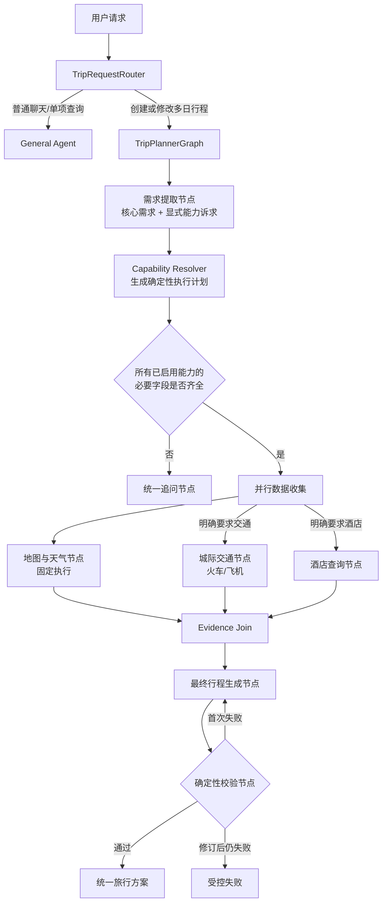

# TripPlannerGraph 可选交通与酒店节点执行计划

## 一、文档信息

- 状态：待实施，产品与架构原则已确认
- 编写日期：2026-07-23
- 适用范围：标准多日城市行程规划链路
- 不适用范围：General Agent、小红书原帖链路、预订、支付、预算 Agent
- 目标：在不新增 Agent 的前提下，把现有地图与天气规划器演进为
  `TripPlannerGraph`，按用户显式要求选择性查询城际交通和酒店

## 二、已确认的产品与架构决策

1. 保留现有一级路由：

   - 普通聊天和单项查询进入 `general_agent`。
   - 创建或修改多日城市行程进入 `trip_planner`。

2. 暂不新增交通 Agent、酒店 Agent 或总编排 Agent；本次只新增职责明确的图节点和服务。
3. 地图与天气是标准多日行程的固定能力，每次字段完整的规划都执行。
4. 只有用户明确要求查询、比较或推荐城际交通时，才执行火车或航班查询。
5. 只有用户明确要求查询、比较或推荐酒店时，才执行酒店查询。
6. 仅提到“从北京出发”“准备坐高铁”“住在春熙路”等背景信息，不自动视为实时查询请求。
7. 用户最新一轮的明确否定指令优先，例如“酒店不用查了”“机票已经订好”会关闭对应能力。
8. 地图、交通和酒店数据收集在字段完整后并行执行；模型不得自行决定并发和工具范围。
9. FlyAI 继续复用现有输入 Schema、CLI 客户端、超时、重试、脱敏和错误封装。
10. 第一版不对 FlyAI `data` 内部的航班、火车和酒店业务字段做强类型解析或确定性校验。
11. 第一版将 FlyAI 返回作为 Opaque Evidence 交给最终模型整理，只校验通用执行状态和能力边界。
12. 地图、路线、日期和天气继续执行现有严格确定性校验。
13. 确定性校验失败时，后端日志必须记录安全、结构化且可定位的具体原因。
14. 产品层第一版不新增“交通和酒店尚未字段级校验”等可靠性边界提示文案。
15. 真实供应商失败、空结果或超时仍须如实呈现，不得为了隐藏边界而伪造成功。
16. 小红书显式数据源开关和现有原帖检索链路不纳入本次改造。

## 三、当前实现基线

当前标准请求由 `ChatService` 调用 `TripRequestRouter`，分类结果只有：

```text
general_agent
trip_planner
```

多日规划进入现有 `MapTripPlanner`，依次完成：

1. 提取目标城市、开始日期、游玩天数和兴趣；
2. 检查必要字段；
3. 并行收集高德 POI、路线和天气；
4. 生成受地图证据约束的文案；
5. 校验日期、地点引用、路线端点和天气建议；
6. 确定性渲染最终 Markdown。

FlyAI 当前已经提供：

- `FlightSearchInput`
- `TrainSearchInput`
- `HotelSearchInput`
- `FlyAIClient.search_flight`
- `FlyAIClient.search_train`
- `FlyAIClient.search_hotel`
- 通用 `FlyAIResult`

但 `FlyAIResult.data` 当前为 `Any`。General Agent 将原始 JSON 作为 `ToolMessage`
交给模型，不对航班、火车或酒店条目做字段级归一化。

## 四、目标流程



## 五、系统不变量

### 1. 路由不变量

- `TripRequestRouter` 继续只判断“是否创建或修改多日行程”。
- Router 不负责拆分火车、飞机、酒店能力。
- Router 模型调用失败时继续降级到 `general_agent`，保留现有行为。
- `planning_source="xhs"` 继续绕过标准规划图，不纳入本次功能。

### 2. 核心请求不变量

- 地图规划的必要字段仍为：

  - `destination_city`
  - `start_date`
  - `duration_days`

- 必要字段缺失时不得调用高德或 FlyAI。
- 一次统一追问应合并核心字段和已启用可选能力的缺失字段。
- `start_date` 表示第一天自然日。
- 行程最后一天为 `start_date + duration_days - 1`。
- 默认返程日期为行程最后一天；用户明确值优先。
- 默认酒店退房日期为行程最后一天；用户明确的晚数或退房日期优先。
- 入住日期必须早于退房日期，返程日期不得早于去程日期。

### 3. 能力不变量

- `map_weather` 固定启用且为必需能力。
- 交通和酒店默认为不执行。
- 交通或酒店只有在用户明确要求查询时启用。
- `Capability Resolver` 只生成执行计划，不调用外部供应商。
- 下游节点严格执行 `CapabilityPlan`，不得自行扩大查询范围。
- 未启用能力返回 `skipped` Evidence，不使用 `None` 隐式表达。

### 4. 事实与输出不变量

- 地图地点、路线、距离和天气事实继续受现有严格证据约束。
- FlyAI 通用外壳必须成功且 `data` 非空，才可作为 `usable` Opaque Evidence。
- FlyAI 失败或空结果时，最终模型不得声称已查询到具体班次或酒店。
- 未启用的能力不得在最终回答中被描述为“实时查询结果”。
- 不得声称完成预订、锁价、占座或确认库存。
- 不得把 API Key、Token、完整命令、本机路径或供应商原始错误暴露给用户。

### 5. 产品展示不变量

- 本次不增加“字段未经确定性校验”等通用可靠性边界提示文案。
- 本次不改变现有登录、会话列表、停止生成和历史消息交互。
- 实际失败、空结果和超时仍使用安全的用户可见状态，不得静默伪装成成功。

## 六、数据契约

以下为目标契约，实施时可根据现有 Schema 命名约定调整文件位置，但不得改变语义。

### 1. 规划请求

保留现有 `CityTripRequest` 作为地图核心请求，在外层新增：

```python
class CapabilityAction(StrEnum):
    UNSPECIFIED = "unspecified"
    ENABLE = "enable"
    DISABLE = "disable"


class TransportMode(StrEnum):
    FLIGHT = "flight"
    TRAIN = "train"


class JourneyScope(StrEnum):
    UNSPECIFIED = "unspecified"
    ONE_WAY = "one_way"
    ROUND_TRIP = "round_trip"


class TransportIntent(TripPlanningModel):
    action: CapabilityAction = CapabilityAction.UNSPECIFIED
    modes: list[TransportMode] = Field(default_factory=list)
    journey_scope: JourneyScope = JourneyScope.UNSPECIFIED
    origin_city: str | None = None
    outbound_date: date | None = None
    return_date: date | None = None
    max_price: float | None = Field(default=None, gt=0)
    evidence_text: str | None = Field(default=None, max_length=500)


class HotelIntent(TripPlanningModel):
    action: CapabilityAction = CapabilityAction.UNSPECIFIED
    check_in_date: date | None = None
    check_out_date: date | None = None
    nearby_poi: str | None = None
    keywords: str | None = None
    hotel_stars: list[int] = Field(default_factory=list)
    max_nightly_price: float | None = Field(default=None, gt=0)
    evidence_text: str | None = Field(default=None, max_length=500)


class TripPlanningRequest(TripPlanningModel):
    core: CityTripRequest
    transport: TransportIntent = Field(default_factory=TransportIntent)
    hotel: HotelIntent = Field(default_factory=HotelIntent)
```

`UNSPECIFIED` 用于多轮修改中的继承语义，`DISABLE` 用于覆盖之前已启用的能力。

### 2. 能力执行计划

```python
class ValueDerivation(TripPlanningModel):
    field: str
    value: str
    source: Literal[
        "explicit_user_input",
        "conversation_context",
        "derived_from_trip_dates",
        "default_policy",
    ]
    explanation: str


class TransportCapabilityPlan(TripPlanningModel):
    enabled: bool = False
    modes: list[TransportMode] = Field(default_factory=list)
    journey_scope: JourneyScope = JourneyScope.UNSPECIFIED
    origin: str | None = None
    destination: str | None = None
    outbound_date: date | None = None
    return_date: date | None = None
    max_price: float | None = None
    reason: str | None = None


class HotelCapabilityPlan(TripPlanningModel):
    enabled: bool = False
    destination: str | None = None
    check_in_date: date | None = None
    check_out_date: date | None = None
    nearby_poi: str | None = None
    keywords: str | None = None
    hotel_stars: list[int] = Field(default_factory=list)
    max_nightly_price: float | None = None
    reason: str | None = None


class CapabilityPlan(TripPlanningModel):
    map_weather_enabled: Literal[True] = True
    transport: TransportCapabilityPlan
    hotel: HotelCapabilityPlan
    derivations: list[ValueDerivation] = Field(default_factory=list)
```

### 3. 完整性检查

```python
class MissingRequirement(TripPlanningModel):
    field: str
    capability: Literal["core", "transport", "hotel"]
    display_name: str
    reason: str


class RequirementCheck(TripPlanningModel):
    complete: bool
    missing: list[MissingRequirement] = Field(default_factory=list)
    errors: list[str] = Field(default_factory=list)
```

统一追问节点只负责渲染 `RequirementCheck`，不得再次推断能力或修改执行计划。

### 4. Opaque FlyAI Evidence

第一版不解析 `data` 内部业务字段：

```python
class EvidenceStatus(StrEnum):
    SKIPPED = "skipped"
    USABLE = "usable"
    EMPTY = "empty"
    FAILED = "failed"


class RawCapabilityEvidence(TripPlanningModel):
    capability: Literal["transport", "hotel"]
    provider: Literal["flyai"]
    status: EvidenceStatus
    query: dict[str, object]
    queried_at: datetime
    duration_ms: int = Field(ge=0)
    data: object | None = None
    warnings: list[str] = Field(default_factory=list)
    error_code: str | None = None
```

状态规则：

- 未启用：`skipped`，`data=None`。
- FlyAI 成功且 `data` 非空：`usable`。
- FlyAI 成功但 `data` 为空：`empty`。
- FlyAI 执行失败、超时或返回无效 JSON：`failed`。

不得把完整原始 FlyAI `data` 写入普通日志、SSE 调试轨迹或工具审计摘要。

### 5. 地图与天气 Evidence

保留现有 `MapTripEvidence` 和 `TripWeatherEvidence`，增加运行级包装：

```python
class MapWeatherEvidenceBundle(TripPlanningModel):
    status: Literal["usable", "partial", "failed"]
    map: MapTripEvidence | None = None
    weather: TripWeatherEvidence | None = None
    warnings: list[str] = Field(default_factory=list)
    error_code: str | None = None
```

地图成功、天气不可用时为 `partial`；地图无法形成可靠景点证据时为 `failed`。

### 6. Evidence Join

```python
class JoinedTripEvidence(TripPlanningModel):
    request: TripPlanningRequest
    capabilities: CapabilityPlan
    map_weather: MapWeatherEvidenceBundle
    transport: RawCapabilityEvidence
    hotel: RawCapabilityEvidence
    overall_status: Literal["usable", "partial", "failed"]
    warnings: list[str] = Field(default_factory=list)
```

汇合规则：

- 地图失败：`overall_status=failed`，不得进入正常最终生成。
- 地图成功，可选能力失败或为空：`overall_status=partial`，继续生成地图行程。
- 所有已启用能力均成功：`overall_status=usable`。
- `skipped` 不影响总体状态。

### 7. LangGraph State

```python
class TripPlanningState(TypedDict, total=False):
    messages: list[ChatMessage]
    planning_run_id: str

    request: TripPlanningRequest
    capability_plan: CapabilityPlan
    requirement_check: RequirementCheck

    map_weather_evidence: MapWeatherEvidenceBundle
    transport_evidence: RawCapabilityEvidence
    hotel_evidence: RawCapabilityEvidence
    joined_evidence: JoinedTripEvidence

    narrative: object
    validation_issues: list[ValidationIssue]
    revision_count: int

    final_answer: str
    current_stage: str
```

并行节点必须写入不同 State key，避免并发合并冲突。

## 七、节点职责与输入输出

| 节点 | 读取 | 写入 | 失败语义 |
|---|---|---|---|
| `extract_requirements` | `messages` | `request` | 模型失败时使用现有确定性日期/天数覆盖；无法提取的字段保持空 |
| `resolve_capabilities` | `messages`, `request` | `capability_plan` | 解析失败时关闭可选能力，地图保持启用，并记录 fallback |
| `validate_requirements` | `request`, `capability_plan` | `requirement_check` | 输出统一缺失项或冲突，不调用供应商 |
| `clarify_requirements` | `requirement_check` | `final_answer` | 输出一次合并追问并结束本轮 |
| `collect_map_weather` | `request.core` | `map_weather_evidence` | 地图失败为硬失败；天气失败为 partial |
| `collect_transport` | `capability_plan.transport` | `transport_evidence` | 未启用为 skipped；供应商失败为 failed，不阻塞地图 |
| `collect_hotels` | `capability_plan.hotel` | `hotel_evidence` | 未启用为 skipped；供应商失败为 failed，不阻塞地图 |
| `join_evidence` | 三类 Evidence | `joined_evidence` | 地图失败时转受控失败；可选能力失败时 partial |
| `generate_itinerary` | `joined_evidence` | `narrative` | 模型失败为受控生成错误 |
| `validate_itinerary` | Evidence + Narrative | `validation_issues` | 记录全部问题；首次失败允许修订一次 |
| `render_response` | Evidence + Narrative | `final_answer` | 只渲染已通过严格地图校验的方案 |

## 八、Capability Resolver 规则

### 1. 明确启用交通

以下表达启用：

- 查询、查找、看看、推荐、比较机票或火车；
- 把往返交通、班次或票务选项加入完整行程；
- 同时比较飞机和高铁。

以下表达不启用：

- 仅说明出发城市；
- 仅说明计划乘坐某种交通；
- 仅说明预算包含交通；
- 仅讨论目的地市内交通。

### 2. 明确启用酒店

以下表达启用：

- 查询、查找、看看、推荐或比较酒店；
- 把住宿选项加入完整行程；
- 给出酒店区域、星级或价格筛选要求并要求搜索。

以下表达不启用：

- 已经有酒店；
- 仅说明入住区域或现有酒店位置；
- 仅说明预算包含住宿；
- 仅要求日程不要离酒店太远。

### 3. 解析策略

1. 需求提取模型返回 `action` 与 `evidence_text`。
2. `evidence_text` 必须可以在最近用户消息中找到；找不到时不得仅凭模型结果启用能力。
3. 最新用户消息中的明确否定优先于较早的启用表达。
4. 修改日程但未提及能力时使用 `UNSPECIFIED`，第一版从最近对话重新提取，不新增持久化 checkpoint。
5. 用户要求比较但未指定交通方式时启用 `flight` 与 `train`。
6. 用户指定单一方式时只执行指定查询。

## 九、并行、取消和降级

### 1. 并行边界

必要字段完整后，并行启动：

- 地图与天气；
- 已启用的交通查询；
- 已启用的酒店查询。

交通节点内部：

- 飞机与火车查询可并行；
- 去程和返程查询可并行；
- 并发仍受现有 `FlyAIClient` 全局并发上限约束。

### 2. 取消传播

- 用户停止生成时必须取消所有未完成子任务。
- 取消不得转换成普通 provider failure。
- 不得在请求取消后继续启动返程、酒店或补偿查询。
- 所有子任务清理完成后沿用现有消息 `interrupted` 持久化语义。

### 3. 降级语义

- Capability Resolver 异常：关闭可选能力，保留地图规划，记录 `fallback`。
- 地图 POI 无法形成可靠证据：整个规划受控失败。
- 天气失败：继续地图规划，天气标记不可用。
- 交通失败或空结果：继续地图规划，不输出虚构班次。
- 酒店失败或空结果：继续地图规划，不输出虚构酒店。
- 最终校验首次失败：携带问题列表修订一次。
- 修订后仍失败：记录全部问题并返回受控错误。

## 十、最终生成与校验边界

### 1. 最终生成

第一版统一方案建议包含：

```text
旅行方案概览
出行日期
城际交通结果（仅启用且有可用结果时）
酒店结果（仅启用且有可用结果时）
每日地图与天气行程
实际失败或空结果说明
数据来源与查询时间
```

交通和酒店部分由最终模型读取 Opaque FlyAI Evidence 后整理；第一版不要求确定性表格渲染。

### 2. 确定性校验范围

必须继续严格校验：

- 行程日索引与日期连续性；
- 地图地点引用与顺序；
- 路线起终点；
- 重复 POI；
- 天气日期覆盖；
- 无天气证据时不得生成具体天气事实；
- 用户未启用交通时不得声称执行了实时交通查询；
- 用户未启用酒店时不得声称执行了实时酒店查询；
- 交通 Evidence 为 `failed/empty/skipped` 时不得声称查到具体班次；
- 酒店 Evidence 为 `failed/empty/skipped` 时不得声称查到具体酒店；
- 不得声称完成预订。

第一版不校验：

- FlyAI `data` 中具体航班号、车次、酒店名称的字段结构；
- 模型转述的每个交通或酒店业务字段是否与原始字段逐项一致；
- FlyAI 价格是每人、每票、每晚或总价的字段级语义。

## 十一、后端日志与可观测性

### 1. 日志总体要求

所有规划日志使用稳定的 `key=value` 字段，至少包含：

```text
event
planning_run_id
conversation_id
assistant_message_id
node
status
duration_ms
```

如上下文不可用，可省略对应 ID，但不得伪造。

禁止记录：

- API Key、Token、Cookie、手机号、验证码；
- 小红书 `xsec_token`；
- 完整 FlyAI 原始响应；
- 完整模型 Prompt 或整段用户对话；
- 供应商内部 URL、本机命令和本机路径；
- 未脱敏的供应商错误正文。

### 2. 节点日志

每个节点至少记录：

```text
event=trip_planner_node_started
event=trip_planner_node_completed
event=trip_planner_node_failed
event=trip_planner_node_cancelled
```

完成日志包含安全指标：

- `extract_requirements`：提取方法、缺失字段名，不记录完整用户原文；
- `resolve_capabilities`：交通/酒店是否启用、模式、推导字段名；
- `collect_map_weather`：POI 数、日数、路线段数、天气覆盖数；
- `collect_transport`：执行了哪些查询、FlyAI success、数据是否为空、耗时；
- `collect_hotels`：FlyAI success、数据是否为空、耗时；
- `join_evidence`：三个能力状态和 `overall_status`；
- `generate_itinerary`：模型调用次数、输出字符数，不记录完整输出；
- `validate_itinerary`：校验次数、问题数、问题代码；
- `render_response`：最终字符数。

### 3. 确定性校验问题模型

校验器返回结构化问题，不只返回字符串：

```python
class ValidationIssue(TripPlanningModel):
    code: str
    path: str
    message: str
    severity: Literal["error", "warning"] = "error"
    expected_summary: str | None = None
    actual_summary: str | None = None
    reference_id: str | None = None
```

建议错误代码至少包含：

```text
DAY_INDEX_MISMATCH
DAY_DATE_MISMATCH
MAP_REFERENCE_ORDER_MISMATCH
MAP_REFERENCE_UNKNOWN
DUPLICATE_POI
ROUTE_ENDPOINT_MISMATCH
WEATHER_DATE_MISMATCH
WEATHER_FACT_WITHOUT_EVIDENCE
TRANSPORT_OUTPUT_WHILE_DISABLED
TRANSPORT_FACT_WITHOUT_USABLE_EVIDENCE
HOTEL_OUTPUT_WHILE_DISABLED
HOTEL_FACT_WITHOUT_USABLE_EVIDENCE
BOOKING_CLAIM_FORBIDDEN
```

确定性校验失败必须记录类似：

```text
event=trip_plan_validation_failed
planning_run_id=<id>
revision_count=0
issue_count=3
issue_codes=DAY_DATE_MISMATCH,MAP_REFERENCE_UNKNOWN,ROUTE_ENDPOINT_MISMATCH
issue_paths=days.1.date,days.2.places.0.reference_id,days.2.route_legs.1
```

对每个问题再记录一条安全详情：

```text
event=trip_plan_validation_issue
planning_run_id=<id>
code=MAP_REFERENCE_UNKNOWN
path=days.2.places.0.reference_id
reference_id=map_day_2_place_9
expected_summary=reference must exist in map evidence
actual_summary=unknown reference
```

不得将完整模型输出或完整 Evidence 序列化进日志。

### 4. 日志级别

- `INFO`：节点开始/完成、能力计划、正常降级状态、供应商安全统计。
- `WARNING`：Router fallback、可选节点失败、Evidence partial、首次校验失败。
- `ERROR`：地图核心失败、修订后仍未通过校验、无法生成受控响应。
- `logger.exception`：非预期内部异常，仅记录脱敏上下文并保留服务端堆栈。

### 5. 日志测试

使用 `caplog` 验证：

- 每个失败场景包含稳定事件名和错误代码；
- 校验失败包含 `planning_run_id`、`revision_count` 和全部问题代码；
- 修订后失败分别记录两次校验；
- 日志不包含测试 API Key、Token、完整原始响应或完整用户消息；
- 取消记录为 cancelled，不误记为 provider failed。

## 十二、SSE 与前端兼容

保留现有 SSE 事件名称，不做破坏性修改。建议新增或复用以下阶段：

```text
understanding_request
resolving_capabilities
checking_requirements
collecting_pois
collecting_weather
collecting_transport
collecting_hotels
joining_evidence
generating_itinerary
validating_itinerary
finalizing
```

要求：

- 旧前端忽略未知阶段后仍可正常接收最终文本；
- 未启用的可选能力可以发送 `skipped` 阶段，也可以不显示，但后端 State 必须是 `skipped`；
- `planning_trace` 只携带安全摘要，不携带完整 FlyAI 原始数据；
- 第一版不增加产品层可靠性边界提示；
- 如仅新增阶段名称且现有前端已支持通用阶段列表，可不改前端；
- 如需展示并行节点状态，只做最小兼容修改。

## 十三、建议代码改动范围

### 1. 后端 Schema

建议新增或调整：

```text
apps/api/app/schemas/trip_planning.py
apps/api/app/schemas/trip_capabilities.py
apps/api/app/schemas/trip_evidence.py
apps/api/app/schemas/trip_validation.py
```

是否拆文件以实现时可读性为准，避免循环依赖。

### 2. Graph

建议新增：

```text
apps/api/app/graphs/trip_planner.py
apps/api/app/graphs/trip_planning_state.py
```

现有 `map_trip_planner.py` 中的数据收集、结构化生成和校验逻辑应按职责抽取后复用，
不得复制出两套逐渐分叉的实现。

### 3. Service

建议新增：

```text
apps/api/app/services/trip_requirement_extractor.py
apps/api/app/services/capability_resolver.py
apps/api/app/services/intercity_transport_service.py
apps/api/app/services/hotel_search_service.py
apps/api/app/services/trip_evidence_joiner.py
apps/api/app/services/trip_plan_validator.py
apps/api/app/services/trip_itinerary_renderer.py
```

实际实施时可以合并规模很小的纯函数模块，避免过度拆文件。

### 4. 复用且原则上不重写

```text
apps/api/app/clients/flyai_client.py
apps/api/app/schemas/travel.py
apps/api/app/services/map_trip_collection_service.py
apps/api/app/services/weather_evidence_service.py
apps/api/app/services/trip_request_router.py
apps/api/app/services/agent_executor.py
```

只有发现明确缺陷或缺少最小图接入接口时才修改，并在实施记录中说明原因。

### 5. 装配

预计涉及：

```text
apps/api/app/main.py
apps/api/app/services/chat_service.py
```

`ChatService` 对外 `stream()` 契约保持不变，内部将多日规划器替换为新的
`TripPlannerGraph` 适配器。

## 十四、实施任务与提交边界

每个独立改动完成必要验证后单独提交，不能把无关修改放入同一提交。

### Task 0：记录基线

- 检查工作区现有改动；
- 运行相关离线测试；
- 记录当前测试数量与结果；
- 不修改业务代码。

### Task 1：新增请求、能力、Evidence 和校验 Schema

- 新增本计划定义的数据模型；
- 保持现有 `CityTripRequest` 和地图 Evidence 兼容；
- 增加纯 Schema 测试；
- 建议提交：`Add trip planner capability contracts`

### Task 2：实现需求提取、Capability Resolver 和统一追问

- 扩展结构化提取；
- 实现 `ENABLE/DISABLE/UNSPECIFIED`；
- 实现证据文本校验、否定覆盖和日期推导；
- 实现统一缺失字段检查；
- 建议提交：`Add optional trip capability resolution`

### Task 3：建立 TripPlannerGraph 骨架

- 新增 StateGraph、条件边和并行分支；
- 使用 Fake 节点验证路由、并行、Join 和取消；
- 不接真实供应商；
- 建议提交：`Add trip planner graph orchestration`

### Task 4：迁移地图与天气固定节点

- 从现有 `MapTripPlanner` 抽取并复用收集逻辑；
- 保持地图结果、天气覆盖和现有校验行为不变；
- 运行现有地图规划回归测试；
- 建议提交：`Move map planning into trip planner graph`

### Task 5：接入 Opaque 交通与酒店节点

- 复用现有 FlyAI Client 和输入 Schema；
- 根据 CapabilityPlan 构建查询；
- 并行执行飞机/火车、去程/返程和酒店；
- 只生成 `RawCapabilityEvidence`；
- 不解析内部业务字段；
- 建议提交：`Add optional transport and hotel graph nodes`

### Task 6：实现 Evidence Join 和最终生成

- 汇总地图、天气、交通和酒店状态；
- 构建统一生成 Prompt；
- 可选能力失败时继续生成地图行程；
- 不增加产品层可靠性边界文案；
- 建议提交：`Join optional evidence into trip itinerary generation`

### Task 7：实现结构化确定性校验和详细日志

- 新增 `ValidationIssue`；
- 保留现有地图、路线、日期和天气校验；
- 增加能力状态与输出行为校验；
- 首次失败允许修订一次；
- 按本计划记录节点和校验失败原因；
- 增加日志脱敏测试；
- 建议提交：`Add deterministic trip validation diagnostics`

### Task 8：接入 ChatService、SSE 和最小前端兼容

- 将标准多日规划切换到新图；
- 保持通用 Agent 和小红书链路不变；
- 保持现有 SSE 事件兼容；
- 仅在确有需要时修改前端阶段展示；
- 建议提交：`Integrate trip planner graph into chat streaming`

### Task 9：全量回归和实施报告

- 运行后端离线测试；
- 运行数据库相关测试；
- 运行前端 typecheck、lint、build；
- 按环境与授权决定是否运行真实 FlyAI/Amap 测试；
- 新增实施报告，记录命令、退出码、未验证项和遗留风险；
- 文档与测试修复按独立范围提交。

## 十五、测试计划

### 1. Capability Resolver

必须覆盖：

- 普通三日游只启用地图；
- “顺便查机票”启用 flight；
- “比较飞机和高铁”启用 flight + train；
- “酒店推荐几个”启用 hotel；
- “我住春熙路”不启用 hotel；
- “酒店已经订好了”关闭 hotel；
- 上一轮启用酒店、下一轮“酒店不用查了”关闭 hotel；
- 缺少出发城市时统一追问；
- 用户明确单程时不查询返程；
- 未明确单程/往返时按已确认默认策略推导。

### 2. Graph

必须覆盖：

- 地图单分支；
- 地图 + 交通；
- 地图 + 酒店；
- 地图 + 交通 + 酒店；
- 可选节点 skipped；
- 交通失败但地图成功；
- 酒店空结果但地图成功；
- 地图失败导致整体失败；
- 取消传播到所有并行任务；
- Join 只执行一次；
- 首次校验失败进入一次修订；
- 第二次失败进入受控错误。

### 3. FlyAI Opaque Evidence

使用 Fake Client 覆盖：

- `success=True, data` 非空；
- `success=True, data=[]`；
- `success=True, data={}`；
- FlyAI timeout；
- FlyAI auth error；
- CLI not found；
- 任意合法嵌套 JSON 作为 Opaque Evidence；
- 原始响应不进入日志和 Planning Trace。

### 4. 确定性校验

必须覆盖每个稳定错误代码，并验证日志内容：

- 日期不匹配；
- 地图引用未知；
- 地点顺序改变；
- 重复 POI；
- 路线端点错误；
- 无天气证据却生成具体天气；
- 未启用交通却声称实时查询；
- 交通 Evidence 不可用却声称有班次；
- 未启用酒店却声称实时查询；
- 酒店 Evidence 不可用却声称有酒店；
- 预订完成声明；
- 一次修订后成功；
- 两次均失败。

### 5. 回归

- 普通聊天仍进入 General Agent；
- 单项航班、火车、酒店查询仍走 General Agent；
- 多日地图规划结果保持兼容；
- 小红书显式原帖检索保持不变；
- 会话中断、历史加载和工具日志保持兼容；
- Router 模型失败仍降级到 General Agent。

## 十六、验证命令

后端命令在仓库根目录、Conda `py312` 环境执行：

```powershell
conda activate py312
python -m pytest -m "not database and not redis and not flyai and not amap and not e2e"
python -m ruff check .
python -m ruff format --check .
git diff --check
```

需要本地服务的测试分别执行并记录结果：

```powershell
python -m pytest -m database
python -m pytest -m redis
```

真实供应商测试只有在已配置凭据且明确允许消耗额度时执行：

```powershell
python -m pytest -m flyai
python -m pytest -m amap
python -m pytest -m e2e
```

前端命令在 `apps/web` 执行：

```powershell
npm run typecheck
npm run lint
npm run build
```

不得把未执行的真实供应商测试写成通过。

## 十七、完成定义

只有同时满足以下条件，才能声明本次功能完成：

- [ ] `TripPlannerGraph` 已替代标准多日行程中的旧单体规划流程；
- [ ] 普通聊天、单项查询和小红书链路行为未改变；
- [ ] 地图与天气在字段完整后固定执行；
- [ ] 交通和酒店只在明确要求时执行；
- [ ] 缺失字段只追问一次，不提前调用供应商；
- [ ] CapabilityPlan 可从 Planning Trace 安全查看；
- [ ] FlyAI 查询复用现有 Client、输入 Schema、超时、重试和脱敏；
- [ ] 第一版只保存 Opaque Evidence，不假装完成字段级校验；
- [ ] 地图、路线、日期和天气严格校验保持有效；
- [ ] 可选节点失败不会伪造结果，也不会不必要地阻塞地图行程；
- [ ] 每个确定性校验失败都产生稳定错误代码和安全日志详情；
- [ ] 修订后仍失败时返回受控错误；
- [ ] 日志不包含完整 FlyAI 数据、密钥、Token、命令或完整用户消息；
- [ ] 产品层未新增通用可靠性边界提示文案；
- [ ] 后端离线测试通过；
- [ ] Ruff 检查和格式检查通过；
- [ ] 前端 typecheck、lint 和 build 通过；
- [ ] 数据库测试结果已记录；
- [ ] 真实供应商测试结果已记录为“通过”“失败”或“未执行”；
- [ ] 每个独立实现阶段均按仓库约定创建了可独立审查的 Git 提交。

## 十八、非目标与后续事项

本次明确不包含：

- 新增专业 Agent；
- 修改一级 Router 为多意图执行计划；
- 将小红书证据并入标准 TripPlannerGraph；
- FlyAI 航班、火车和酒店字段级归一化；
- 交通与酒店事实的确定性逐字段校验；
- 自动预订、支付、锁价或库存保证；
- 完整预算模型或预算 Agent；
- 酒店坐标补全及酒店与每日 POI 的联合路线优化；
- LangGraph checkpoint 或 Redis 规划状态；
- `travel_plans` / `travel_plan_versions` 的正式接入；
- 产品层新增可靠性边界提示；
- 新供应商或新数据库。

后续如需要更强事实保证，可在不改变 Graph 主结构的前提下，将
`RawCapabilityEvidence` 演进为强类型 `TransportEvidenceBundle` 和
`HotelEvidenceBundle`。

## 十九、实施报告模板

实施完成后新增报告，至少记录：

```text
实施日期：
实施提交：
新增迁移：
新增配置：

后端离线测试：
数据库测试：
Redis 测试：
Ruff check：
Ruff format：
前端 typecheck：
前端 lint：
前端 build：
真实 FlyAI：
真实 Amap：
E2E：

校验日志抽样：
取消传播验证：
回归结果：
未执行项：
遗留风险：
回滚方式：
```

